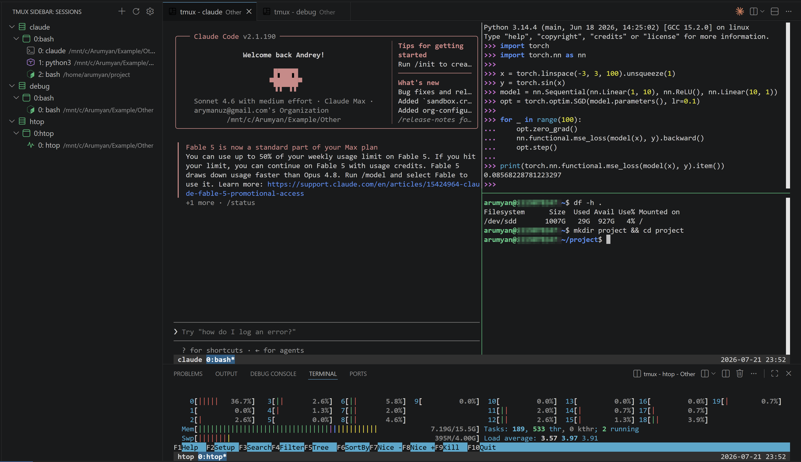
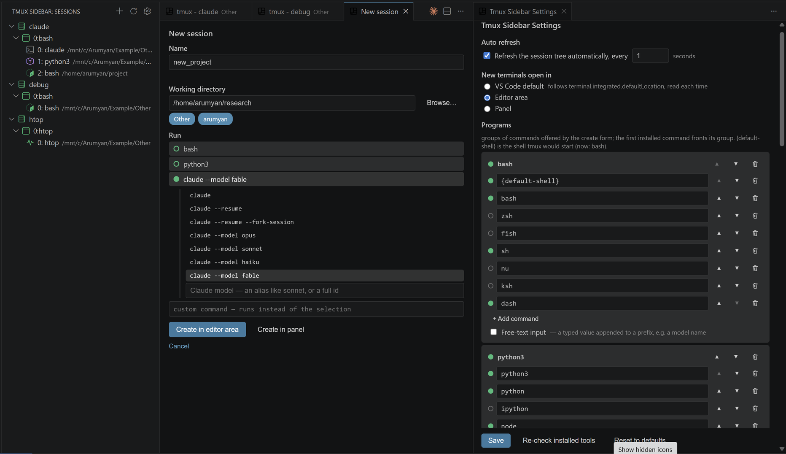

# Tmux Sidebar for VS Code

[](https://opensource.org/licenses/MIT)

Easily manage your Tmux sessions, windows, and panes in the VS Code sidebar.



## ✨ Features

-   **🌲 Tree View**: Displays all Tmux elements in a clear tree structure: Session -> Window -> Pane.
-   **🖱️ One-Click Actions**:
    -   **Quick Attach**: Click the launch icon (▶) next to any session, window, or pane to attach it in the VS Code integrated terminal.
    -   **Smart Terminal Reuse**: Reuses the terminal already attached to a session instead of opening another one.
-   **📝 Create Form**: One form for new sessions, windows and splits — name, working directory, and what to run, with big create buttons at the end. Panes split in all four directions (right, left, down, up).
-   **🚀 Program Launcher**: Start a pane straight into what you need: your shell, a Python/Node REPL, AI tools (claude, codex, gemini, aider — with resume and model variants), lazygit and friends, or any command you type. Only what is actually installed is offered, and `{default-shell}` resolves to the shell tmux itself would start. The whole list is yours to edit on the settings page.
-   **⚙️ Settings Page**: Auto-refresh with its interval, where new terminals open (VS Code default / editor area / panel), and the full program list — with installed-state dots, a re-check button, and reordering.
-   **🪟 Windows Support**: Uses [psmux](https://github.com/psmux/psmux) on Windows and `tmux` everywhere else, picked automatically — see [Requirements](#-requirements).
-   **🧹 Clean Terminal Behaviour**: Tmux runs as the terminal's own process, so leaving it closes the tab, and relaunching a terminal reattaches instead of leaving you in a bare shell.



## 📋 Requirements

-   **`tmux`** on Linux and macOS.
-   **[`psmux`](https://github.com/psmux/psmux)** on Windows — a native, tmux-compatible multiplexer (`winget install psmux`).

Which one is used depends on where the extension actually runs, not on where the
VS Code window is: connected to WSL, an SSH host or a container, it uses `tmux`
on that machine. Only a local Windows setup uses `psmux`.

If the binary is missing, the extension says so and gives you the install command
for your system.

## 🚀 Installation

The extension is not published to the VS Code Marketplace yet, so install it from
a `.vsix` file:

1.  Download the latest `.vsix` from the [Releases page](https://github.com/arymanuz/vscode-tmux-sidebar/releases), or build one yourself (see [Development](#-development)).
2.  In VS Code, open the Extensions view (`Ctrl+Shift+X`).
3.  Click the `...` (More Actions) button at the top of the view.
4.  Select **Install from VSIX...** and choose the file.

Or from the command line:

```shell
code --install-extension vscode-tmux-sidebar-1.0.0.vsix
```

## 📖 Usage

1.  **Open the View**: Click the **Tmux icon** in the VS Code Activity Bar on the left to see all your running Tmux sessions.
2.  **Refresh**: Click the refresh button in the view's title bar to manually sync the Tmux state.

With no sessions running, the view offers a button to create the first one.

### Session Actions
-   **Attach**: Click the **▶** icon to the right of the session item.
-   **New Window**: Click the **+** icon to the right of the session item, or right-click and select "New Window".
-   **Rename**: Right-click the session and select "Rename Session".
-   **Delete**: Right-click the session and select "Delete Session".

### Window Actions
-   **Attach**: Click the **▶** icon to the right of the window item to switch to that window.
-   **Close**: Right-click the window and select "Kill Window".

### Pane Actions
-   **Attach**: Click the **▶** icon to the right of the pane item to switch to that pane.
-   **Split Pane**: Click the split icon to the right of the pane item — the form lets you pick the direction (right, left, down or up), the working directory and what to run.
-   **Close**: Right-click the pane and select "Kill Pane".

## 🎒 Development

```shell
npm install          # install dependencies
npm run compile      # build src/ into out/
npm run watch        # rebuild on change
```

Press `F5` to launch a second VS Code window with the extension loaded.

To build an installable package:

```shell
npm install -g @vscode/vsce
vsce package
```

The gallery icon is generated from its SVG source and is not drawn by hand:

```shell
rsvg-convert -w 128 -h 128 -o resources/icon-gallery.png resources/icon-gallery.svg
```

## 🙏 Credits

This is a fork of [vscode-tmux-manager](https://github.com/ZeroRegister/vscode-tmux-manager)
by ZeroRegister. See the [changelog](./CHANGELOG.md) for what has changed since.

## 📄 License

This project is licensed under the [MIT](https://opensource.org/licenses/MIT) License.
Copyright is held by the original author and by contributors to this fork; see [LICENSE](./LICENSE).
